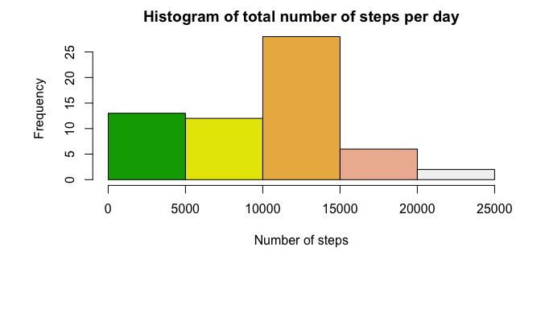
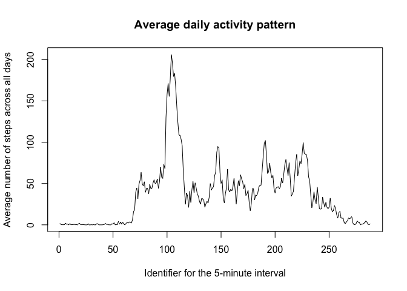
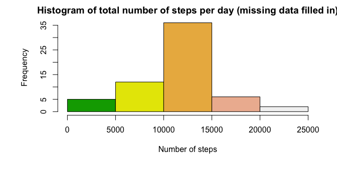
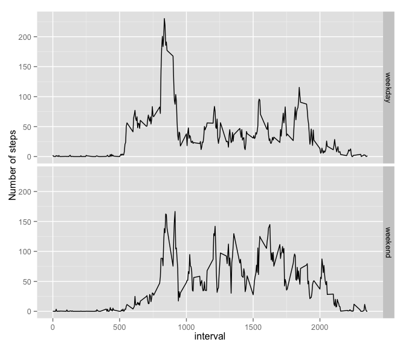

# Reproducible Research: Peer Assessment 1

## Loading and preprocessing the data

```r
setwd("/Users/yinagu/GitHub/RepData_PeerAssessment1/")
act <- read.csv('activity.csv', sep=",", na.strings = "NA")
act$date <- as.Date(as.character(act$date), "%Y-%m-%d") # Convert 2nd column into date
```

## What is mean total number of steps taken per day?
1. A histogram of the total number of steps taken each day is created and shown below.


```r
daySteps <- with(act, tapply(steps, date, sum, na.rm = T))
par(mar=c(8,6,2,2), bg="white")
hist(daySteps, main="Histogram of total number of steps per day", col = terrain.colors(5), xlab = "Number of steps")
```

 

2. Calculate and report the mean and median total number of steps taken per day


```r
a <- mean(daySteps)
b <- median(daySteps)
```

- The mean total number of steps taken per day is 9354.2295082.
- The median total number of steps taken per day is 10395.

## What is the average daily activity pattern?
1. A time series plot of the 5-minute interval and the average number of steps taken, averaged across all days is created and shown: 


```r
intervalSteps <- with(act, tapply(steps, interval, mean, na.rm = T))
plot(intervalSteps, type = 'l', main = "Average daily activity pattern", xlab = "Identifier for the 5-minute interval", ylab = "Average number of steps across all days")
```

 

2. Calculate which 5-minute interval, on average across all the days in the dataset, contains the maximum number of steps.


```r
c <- names(which.max(intervalSteps))
```

The identifier 835 for the 5-minute interval, on average across all the days contains the maximum number of steps.

## Imputing missing values
1. Calculate and report the total number of missing values in the dataset


```r
totalNA <- sum(is.na(act$steps))
```

The total number of missing values in the dataset is 2304.

2. A strategy for filling in all of the missing values in the dataset is imputing missing values by the mean for that 5-minute interval. 

3. Then create a new dataset named 'act' that is equal to the original dataset but with the missing data filled in.


```r
intervalID <- as.numeric(names(intervalSteps))
actNA <- act # save original dataset as actNA
for (x in 1:length(intervalSteps)) {
	act[(act$interval == intervalID[x] & is.na(act$steps)), "steps"] = intervalSteps[x]
}
summary(act)
```

```
##      steps             date               interval     
##  Min.   :  0.00   Min.   :2012-10-01   Min.   :   0.0  
##  1st Qu.:  0.00   1st Qu.:2012-10-16   1st Qu.: 588.8  
##  Median :  0.00   Median :2012-10-31   Median :1177.5  
##  Mean   : 37.38   Mean   :2012-10-31   Mean   :1177.5  
##  3rd Qu.: 27.00   3rd Qu.:2012-11-15   3rd Qu.:1766.2  
##  Max.   :806.00   Max.   :2012-11-30   Max.   :2355.0
```

4. Make a histogram of the total number of steps taken each day.


```r
daySteps2 <- with(act, tapply(steps, date, sum))
par(mar=c(8,6,2,2), bg="white")
hist(daySteps2, main="Histogram of total number of steps per day (missing data filled in)", col = terrain.colors(5), xlab = "Number of steps")
```

 

```r
a2 <- mean(daySteps2)
b2 <- median(daySteps2)
```

For the new dataset with missing data filled in: 
- The mean total number of steps taken per day is 1.0766189\times 10^{4}.
- The median total number of steps taken per day is 1.0766189\times 10^{4}.
The mean and median values calculated from new dataset differ from the original dataset. By imputing missing data, the total daily number of steps increased on average from 9354.2295082 to 1.0766189\times 10^{4}.

## Are there differences in activity patterns between weekdays and weekends?
1. Create a new factor variable in the dataset with two levels -- "weekday" and "weekend" indicating whether a given date is a weekday or weekend day.


```r
library(dplyr)
```

```
## 
## Attaching package: 'dplyr'
## 
## The following object is masked from 'package:stats':
## 
##     filter
## 
## The following objects are masked from 'package:base':
## 
##     intersect, setdiff, setequal, union
```

```r
act <- mutate(act, weekday = factor(1* (weekdays(date) %in% c("Saturday", "Sunday")), labels = c("weekday", "weekend")))
summary(act)
```

```
##      steps             date               interval         weekday     
##  Min.   :  0.00   Min.   :2012-10-01   Min.   :   0.0   weekday:12960  
##  1st Qu.:  0.00   1st Qu.:2012-10-16   1st Qu.: 588.8   weekend: 4608  
##  Median :  0.00   Median :2012-10-31   Median :1177.5                  
##  Mean   : 37.38   Mean   :2012-10-31   Mean   :1177.5                  
##  3rd Qu.: 27.00   3rd Qu.:2012-11-15   3rd Qu.:1766.2                  
##  Max.   :806.00   Max.   :2012-11-30   Max.   :2355.0
```

2. Make a panel plot containing a time series plot of the 5-minute interval and the average number of steps taken, averaged across all weekday days or weekend days.


```r
library(ggplot2)
```

```
## Warning: package 'ggplot2' was built under R version 3.1.3
```

```r
intervalStepsWeekday <- with(act[act$weekday == "weekday",], tapply(steps, interval, mean))
intervalStepsWeekend <- with(act[act$weekday == "weekend",], tapply(steps, interval, mean))
xy <-data.frame(interval = as.numeric(names(intervalStepsWeekday)), mean_steps = intervalStepsWeekday, weekday = rep("weekday", length(intervalStepsWeekday)))
xy <-rbind(xy, data.frame(interval = as.numeric(names(intervalStepsWeekend)), mean_steps = intervalStepsWeekend, weekday = rep("weekend", length(intervalStepsWeekend))))
g <- ggplot(xy, aes(interval, mean_steps))
g + geom_line() + facet_grid(weekday ~ .) + labs(y = "Number of steps")
```

 
